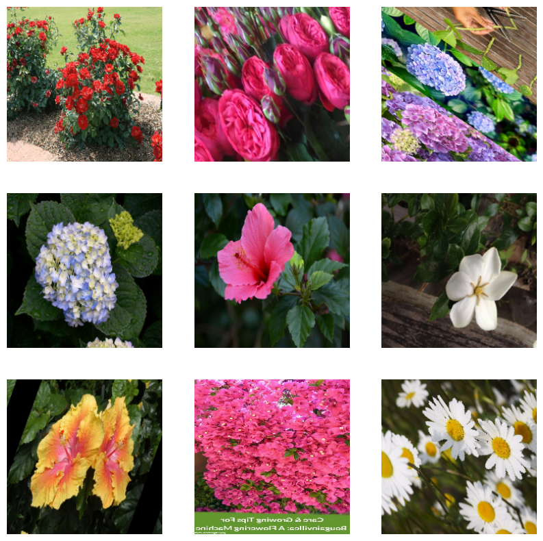
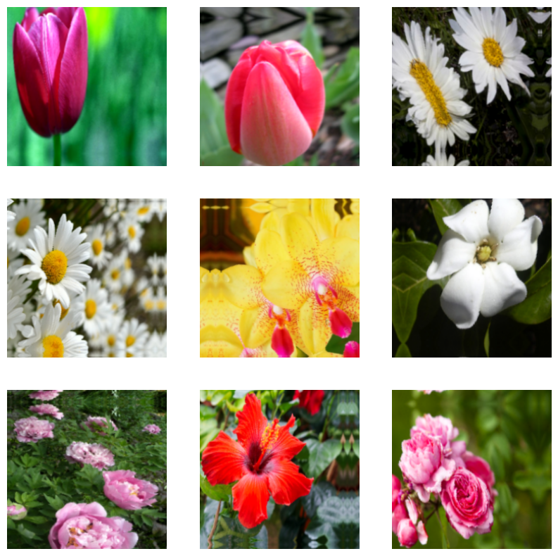
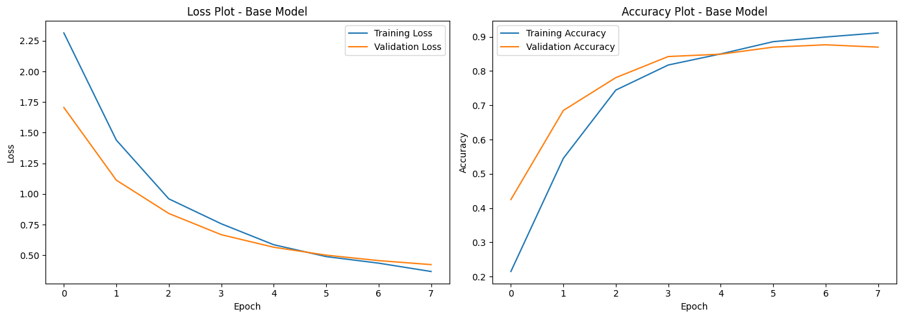
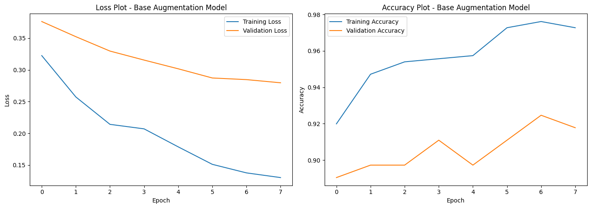
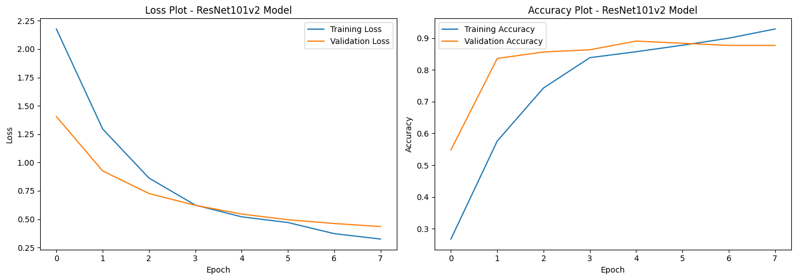
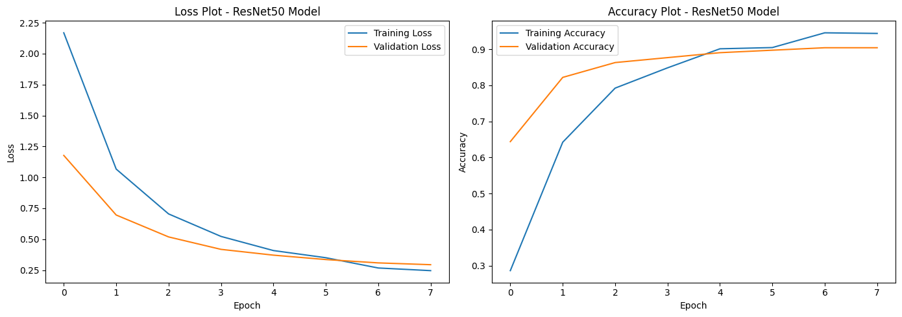
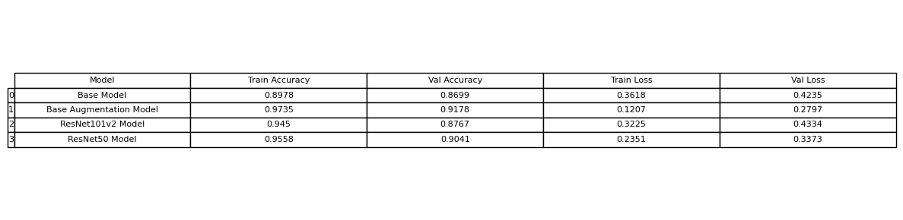
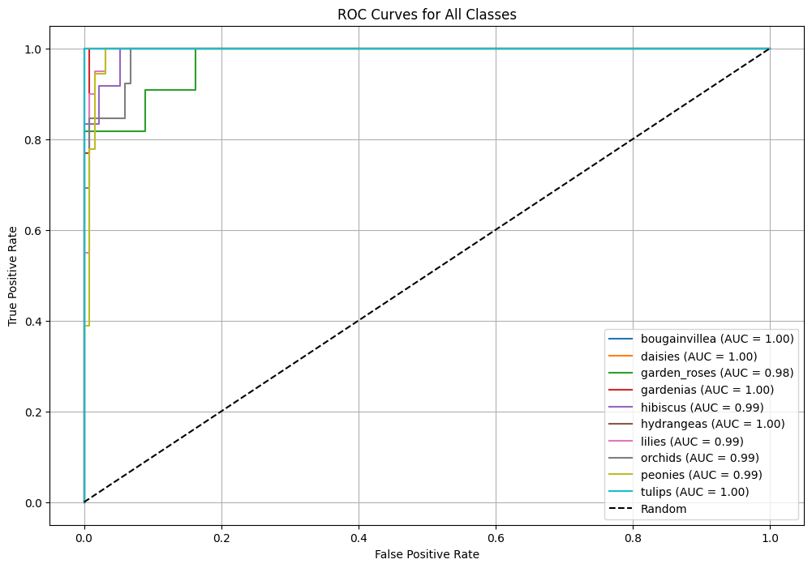

# Computer Vision Flower Image Classification

This repository outlines an attempt to use transfer learning models to classify images of flowers using the dataset "Flower Images Dataset" on Kaggle, found [here](https://www.kaggle.com/datasets/aksha05/flower-image-dataset).

## Overview

The task, as defined by the Kaggle challenge is to use a set of 733 images of flowers to train a transfer learning model to accurately classify these images into one of 10 possible classes of flowers. In this repository, four models are attempted using three different transfer learning models (MobileNetv2, ResNet101v2, ResNet50) to attempt to achieve the highest non-trivial accuracy scores. The MobileNetv2 model with five total image augmentations achieved the highest validation accuracy score of 0.91, meaning that 91% of the time, the model was able to accurately classify an image of a flower.

## Summary of Workdone

### Data

* Data:
  * Type: For example
    * Input: Flower images (244x244 pixel jpegs), image filename -> flower type
    * Class names: 10 total; tulips, orchids, peonies, hydrangeas, lilies, gardenias, garden roses, daisies, hibiscus, bougainvillea
  * Size: 733 unique images
  * Instances (Train, Test, Validation Split): 733 images for use, with 587 images for training and 146 images for validation 

#### Preprocessing / Clean up

* To ensure the directory was organized correctly, I manually sorted the flowers into sub-directories named after each class
* For ease of training, I created a data loading module to use for each new notebook

#### Data Visualization

The image below displays as 3x3 grid of images after being augmented (randomly flipped and rotated), used for intial base modeling

 

The image below shows a 3x3 grid of images after being augmented even further (randomly flipped, rotated, zoomed, translated, or adjusted contrast), used for model iterations

 

### Problem Formulation

* Input: randomly augmented images belonging to one of ten possible classes
* Output: model metrics to determine model performance
* Models
  * MobileNetv2: I worked with this model initially to build off of a provided example and establish a decent baseline set of metrics
  * ResNet101v2: I chose this model because it had a high accuracy score on the Keras website
  * ResNet50: I chose this model to work with a different version of ResNet and determine if there are noticable differences in metrics
* Loss: Sparse categorical cross entropy to handle the multiple class options
* Optimizer: Adam
* Metrics: Sparse categorical accuracy

### Training

* Describe the training:
  * How you trained: software and hardware.
  * Software: Python 3.10 in a virtual environment, Jupyter Notebook
  * Hardware: personal Macbook Air
  * I chose to stop training after 8 epochs for each model because I felt that the results were consistent and did not take too long to run each model
  * Difficulties: I spent a lot of time reworking my data loading module to make sure the loading and augmentation process were done separately to avoid any repeat augmentations or unwanted results.

The following images are the plotting training curves for each of my four models

### Performance Comparison

* Key performance metric: validation accuracy

The image below displays a table showing the metrics of each model

The following image displays the plot of all of the ROC curves for each class for my second model, the further augmented MobileNetv2 model

### Conclusions

* Applying multiple reasonable augmentations to the images while using the MobileNetv2 trained from an initial, less augmented dataset, gave a validation accuracy score of 91%, which was the highest validation score between all of the models. I belive having more augmentations helped provide "new" or unseen data to use for training, and I also belive that using one of my own trained models helped. 

### Future Work

* I would like to try building on the other two models, ResNet101v2 and ResNet50, and seeing if I can train them further using either more augmentations or new, unseen flower images. I would also like to try to run more epochs for each model, to see if more training will help the scores or if they will neutralize after a certain point.

### Overview of files in repository

* The initial dataset downloaded from Kaggle does have to be organized into the proper subdirectories for these notebooks to run properly
* File overview:
  * data_loader.py: function that loads the image dataset
  * train_base_model.ipynb: Trains the first model off of augmented images, provides training curves, and saves model
  * train_base_model_augmentation.ipynb: Trains using the previously saved model (train_base_model.ipynb), plots training curves, and saves model
  * train_resnet101v2.ipynb: Trains a new model using ResNet101v2, plots training curves, and saves model
  * train_resnet50.ipynb: Trains a new model using ResNet50, plots training curves, and saves model
  * comparison_models.ipynb: Takes saved models from previous notebooks and plots ROC curves for all classes for each model

### Software Setup
* Required packages:
  * tensorflow
  * keras
  * matplotlib
  * scikit-learn
  * pandas
  * numpy
* All packages can be installed using pip command
